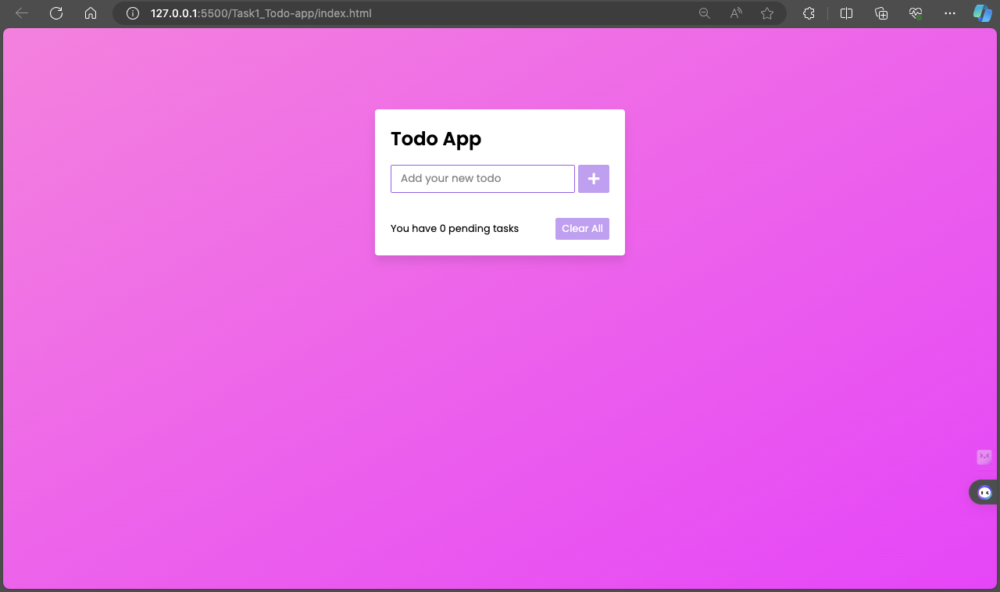
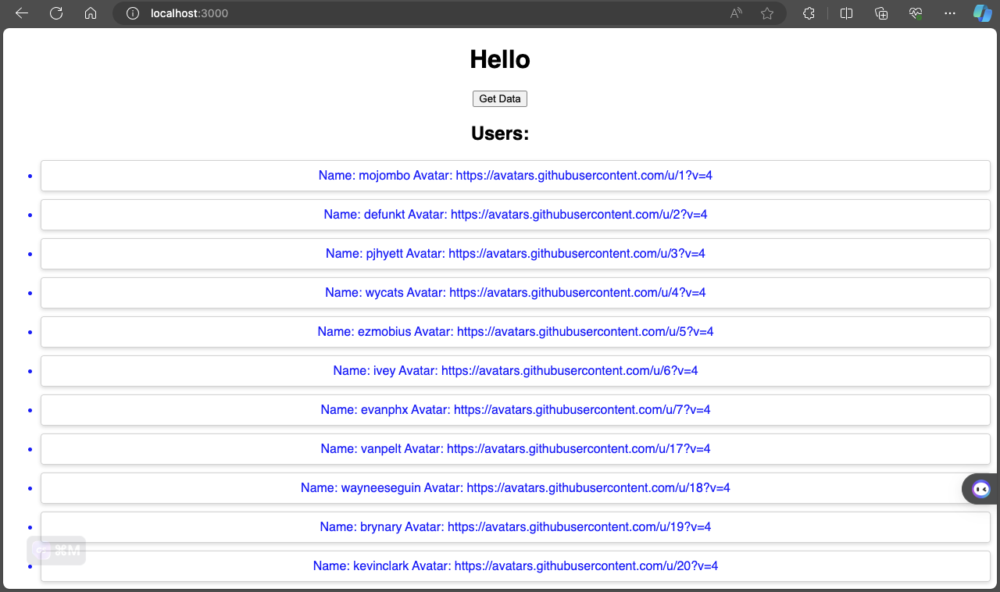
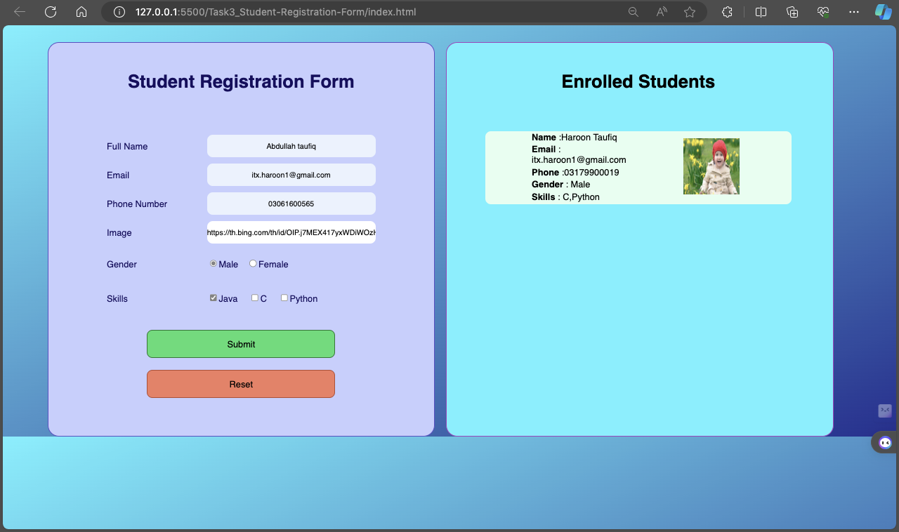
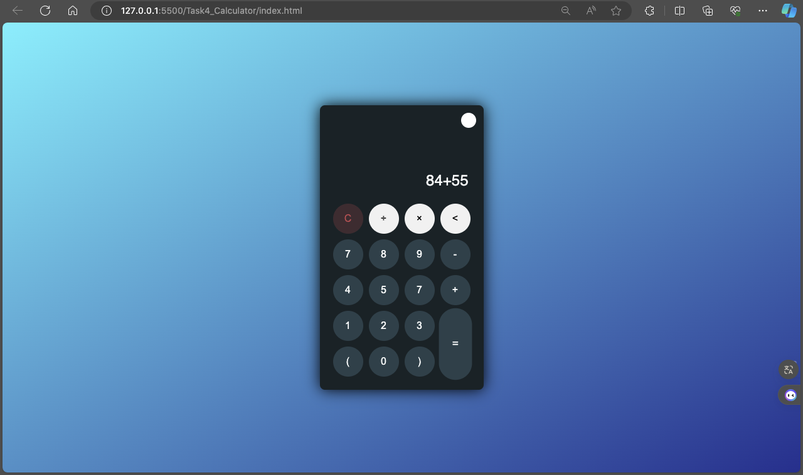

# My Projects

This repository contains four projects that I have completed:

1. **To-Do List App**: A simple web application built with HTML, CSS, and JavaScript. It allows users to add, delete, and mark tasks as completed.

2. **User Data Display**: A React application that fetches user data from an API and displays it on the front page.

3. **Registration Form**: A web application built with HTML, CSS, and JavaScript. It includes form validation and error handling.

4. **Calculator**: A simple calculator built with HTML, CSS, and JavaScript. It supports basic arithmetic operations.

## Installation

For each project, you will need to clone the repository and open the HTML file in your browser. For the React User Data Display, you will also need to install dependencies and start the development server.

## Usage

Detailed usage instructions are provided in the README file of each individual project.

## Contributing

Contributions are welcome! Please read the contributing guidelines before getting started.